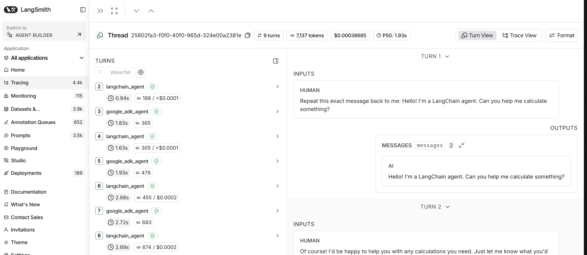

# A2A Distributed Tracing Project



This project demonstrates Agent-to-Agent (A2A) communication between different agent frameworks, enabling distributed tracing and conversation across multiple agent implementations.

## Project Structure

```
A2A-distributed-tracing/
├── langgraph_agent/      # LangGraph-based agent
│   ├── agent.py          # Main agent implementation
│   ├── test_agent.py     # Test script for this agent
│   └── langgraph.json    # LangGraph configuration
├── langchain_agent/      # LangChain v1-based agent
│   ├── agent.py          # Main agent implementation
│   ├── test_agent.py     # Test script for this agent
│   └── langgraph.json    # LangGraph configuration
├── google_adk/           # Google ADK-based agent
│   ├── agent.py          # Main agent implementation
│   └── test_agent.py     # Test script for this agent
└── test_agent_conversation.py  # Multi-agent conversation test
```

## Overview

This project contains three different agent implementations, all communicating via the A2A protocol:

1. **LangGraph Agent** (`langgraph_agent/`): Uses LangGraph's StateGraph directly
2. **LangChain Agent** (`langchain_agent/`): Uses LangChain v1's `create_agent` API with middleware
3. **Google ADK Agent** (`google_adk/`): Uses Google ADK's `to_a2a()` function

All agents are specialized in fluid dynamics and Navier-Stokes equations, and can communicate with a mathematics professor (Google ADK agent) for calculations.

## Prerequisites

1. **Install uv** (if not already installed):
   ```bash
   curl -LsSf https://astral.sh/uv/install.sh | sh
   ```
   Or using Homebrew on macOS:
   ```bash
   brew install uv
   ```

2. **Install dependencies:**
   ```bash
   uv sync
   ```

3. **Configure environment variables:**
   Create a `.env` file in the root directory:
   ```
   OPENAI_API_KEY=your_openai_api_key_here
   LANGSMITH_API_KEY=your_langsmith_api_key_here  # Optional, for distributed tracing
   LANGSMITH_PROJECT=a2a-distributed-tracing  # Optional, defaults to "a2a-distributed-tracing"
   ```

## Testing Individual Agents

Each agent folder contains a `test_agent.py` script to test that agent independently:

### LangGraph Agent

```bash
cd langgraph_agent
uv run langgraph dev --port 2024
# In another terminal:
uv run python test_agent.py <assistant_id>
```

### LangChain Agent

```bash
cd langchain_agent
uv run langgraph dev --port 2026
# In another terminal:
uv run python test_agent.py <assistant_id>
```

### Google ADK Agent

```bash
uv run uvicorn google_adk.agent:a2a_app --host localhost --port 8002
# In another terminal:
uv run python google_adk/test_agent.py
```

## Running Multi-Agent Conversations

The `test_agent_conversation.py` script demonstrates A2A communication between agents:

### Prerequisites

1. **Start LangChain agent:**
   ```bash
   cd langchain_agent
   uv run langgraph dev --port 2024
   ```
   Copy the `assistant_id` from the output.

2. **Start Google ADK agent:**
   ```bash
   uv run uvicorn google_adk.agent:a2a_app --host localhost --port 8002
   ```

### Run Conversation

```bash
uv run python test_agent_conversation.py <langchain_assistant_id>
```

Or with environment variable:
```bash
export LANGCHAIN_ASSISTANT_ID=<assistant_id>
uv run python test_agent_conversation.py
```

The script will:
- Use `context_id` as `thread_id` to group traces in LangSmith
- Share the same `thread_id` between both agents for unified tracing
- Simulate a conversation between LangChain and Google ADK agents
- Maintain conversation context across multiple rounds using A2A `contextId`

## Agent Details

### LangGraph Agent

- **Location**: `langgraph_agent/`
- **Port**: 2024
- **Implementation**: Uses LangGraph's `StateGraph` directly
- **System Prompt**: Specialized in fluid dynamics and Navier-Stokes equations
- **Features**: Direct StateGraph construction, custom state management

### LangChain Agent

- **Location**: `langchain_agent/`
- **Port**: 2024 (configurable)
- **Implementation**: Uses LangChain v1's `create_agent` API
- **System Prompt**: Specialized in fluid dynamics and Navier-Stokes equations
- **Features**: 
  - Uses `create_agent` directly (no manual StateGraph)
  - Custom middleware for A2A message format conversion
  - Extensible with LangChain tools

### Google ADK Agent

- **Location**: `google_adk/`
- **Port**: 8002
- **Implementation**: Uses Google ADK's `to_a2a()` function
- **Functionality**: Calculator agent with mathematical operations
- **Features**:
  - Auto-generated agent card
  - Exposed via uvicorn
  - Acts as "mathematics professor" for other agents
  - OpenTelemetry tracing to LangSmith (same project as other agents)

## A2A Protocol Details

The project follows the [A2A Protocol Specification](https://a2a-protocol.org/latest/specification/) for multi-turn conversations, specifically using `contextId` per section 3.4.2 (Multi-Turn Conversation Patterns).

### LangGraph/LangChain Agents (Standard A2A)

- **Endpoint**: `http://localhost:{port}/a2a/{assistant_id}`
- **Format**: Standard A2A protocol
- **Context ID**: Used inside `message.contextId` for multi-turn conversation continuity
- **Task ID**: Optionally included in `message.taskId` for follow-up messages referencing specific tasks
- **Metadata**: `thread_id` (using `context_id` value) added at payload root level for LangSmith tracing

### Google ADK Agent (to_a2a format)

- **Endpoint**: `http://localhost:8002/` (root endpoint)
- **Format**: `to_a2a()` specific format
- **Context ID**: Used inside `message.contextId` for multi-turn conversation continuity
- **Task ID**: Optionally included in `message.taskId` for follow-up messages
- **Message ID**: Inside `message` object (not at params level)
- **Metadata**: `thread_id` (using `context_id` value) added at payload root level for LangSmith tracing

### Multi-Turn Conversation Pattern

According to A2A spec 3.4.2:
- **Context Continuity**: Task objects maintain conversation context through the `contextId` field
- **Follow-up Messages**: Clients can include `contextId` in subsequent messages to continue a previous interaction
- **Task References**: Clients can use `taskId` (with or without `contextId`) to continue or refine a specific task
- **Context Inheritance**: New tasks created within the same `contextId` can inherit context from previous interactions

## Distributed Tracing

The project uses distributed tracing to track agent interactions across multiple agents, ensuring all traces are grouped in the same thread in LangSmith.

### Thread ID Metadata

All agents use `thread_id` in metadata (using `context_id` value) to group traces in LangSmith. Both agents share the same `thread_id` to ensure unified tracing:

```python
# First message (no contextId - server generates it)
# Use a shared thread_id for both agents
thread_id = str(uuid.uuid4())

payload = {
    "jsonrpc": "2.0",
    "id": str(uuid.uuid4()),
    "method": "message/send",
    "params": {
        "message": {
            "role": "user",
            "parts": [{"kind": "text", "text": "Hello"}],
            "messageId": str(uuid.uuid4())
        },
        "messageId": str(uuid.uuid4())
    },
    "metadata": {"thread_id": thread_id}  # Groups traces in LangSmith
}

# Follow-up message (includes contextId inside message object)
# Use context_id as thread_id once available
thread_id = context_id  # From previous response

payload = {
    "jsonrpc": "2.0",
    "id": str(uuid.uuid4()),
    "method": "message/send",
    "params": {
        "message": {
            "role": "user",
            "parts": [{"kind": "text", "text": "Follow-up"}],
            "messageId": str(uuid.uuid4()),
            "contextId": context_id  # From previous response
        },
        "messageId": str(uuid.uuid4())
    },
    "metadata": {"thread_id": thread_id}  # Use context_id as thread_id
}
```

**Key Points:**
- `context_id` from A2A responses is used as `thread_id` in metadata
- Both agents share the same `thread_id` value to ensure traces are grouped together
- The `thread_id` is synchronized between agents when either receives a new `context_id`

### OpenTelemetry Tracing (Google ADK)

The Google ADK agent includes OpenTelemetry instrumentation that automatically sends traces to LangSmith:

- **Basic tracing**: Uses `langsmith.integrations.otel.configure()` for automatic tracing
- **Thread ID extraction**: Middleware extracts `thread_id` from request metadata and sets it as `langsmith.metadata.thread_id` in span attributes
- **Unified project**: All traces go to the same LangSmith project (`a2a-distributed-tracing` by default)
- **Complete visibility**: Captures agent conversations, tool calls, and model interactions
- **Thread grouping**: Uses `langsmith.metadata.thread_id` attribute to group traces in the same thread

To enable tracing, set the `LANGSMITH_API_KEY` environment variable. The project name can be customized via `LANGSMITH_PROJECT` (defaults to `a2a-distributed-tracing`).

**Note**: The `openinference` package for Google ADK instrumentation may not be available yet. The code will gracefully fall back to basic LangSmith tracing if the package is not installed.

### Benefits

This tracing setup allows you to:
- Track complete conversations across multiple agents
- Group related traces by thread_id (using context_id) in LangSmith
- View all agent interactions in the same thread for unified analysis
- Analyze agent-to-agent communication patterns
- Debug distributed agent interactions
- View detailed OpenTelemetry spans for Google ADK operations with thread_id in metadata

## Development

### Adding New Agents

1. Create a new folder (e.g., `new_agent/`)
2. Implement the agent following A2A protocol
3. Add a `test_agent.py` script
4. Update this README with agent details

### Extending Agents

- **LangChain Agent**: Add tools using `@tool` decorator and pass to `create_agent()`
- **LangGraph Agent**: Add nodes to the StateGraph
- **Google ADK Agent**: Add functions as tools to the Agent

## Troubleshooting

### Port Conflicts

- LangGraph/LangChain agents: Change port in `uv run langgraph dev --port {port}`
- Google ADK agent: Change port in `agent.py` or uvicorn command

### Agent Not Responding

- Check server logs for errors
- Verify agent card endpoint is accessible
- Ensure all dependencies are installed: `uv sync`
- Check environment variables are set correctly

### Import Errors

- Reinstall dependencies: `uv sync`
- Use `uv run` to ensure the correct environment is used

## References

- [LangGraph Documentation](https://langchain-ai.github.io/langgraph/)
- [LangChain v1 Agents](https://docs.langchain.com/oss/python/langchain/agents)
- [Google ADK Documentation](https://github.com/google/adk-python)
- [A2A Protocol Specification](https://a2a-protocol.org/)
